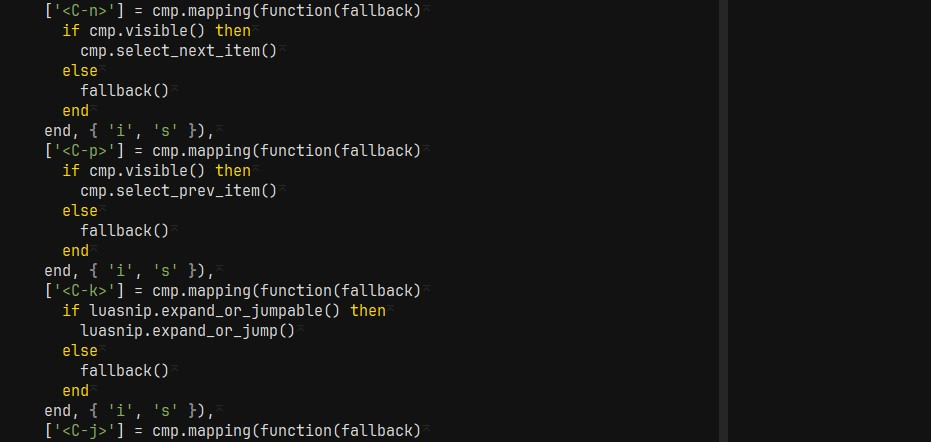

# Poser: The Colorscheme Based On Another Colorscheme

A colorscheme heavily inspired by [Tsoding's](https://github.com/tsoding)
colorscheme, though not accurately (I couldn't be bothered).

## Requirements
Made with [lush.nvim](https://github.com/rktjmp/lush.nvim). Therefore, lush is
required. Then install as per usual.
